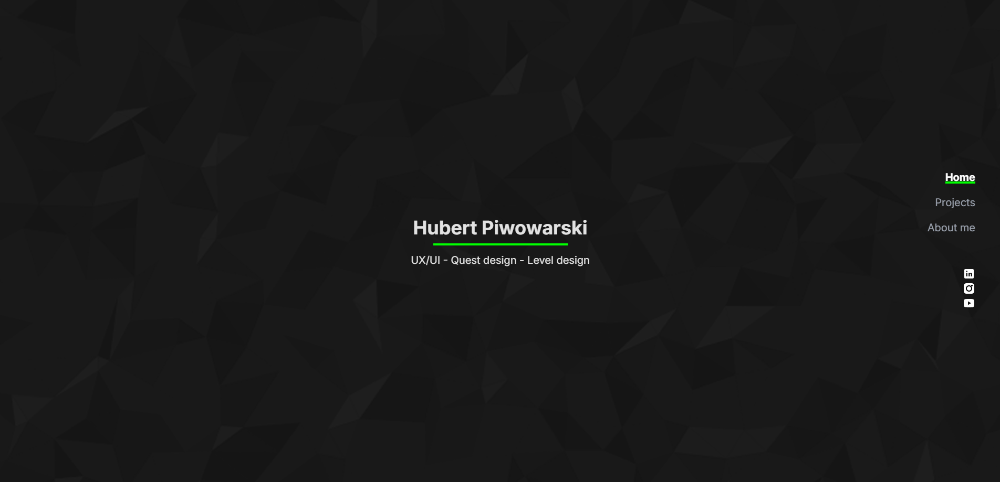

# Hubert Piwowarski - Portfolio Website

A modern, responsive portfolio website showcasing UX/UI design, level design, and quest design work. Built with Next.js and featuring smooth scrolling navigation, interactive animations, and a clean, professional design.



##  Features

- **Single-page design** with smooth scrolling navigation
- **Responsive layout** that works on all devices
- **Fixed navigation menu** with active section highlighting
- **Interactive animations** including fade-in effects for the About section
- **Project showcase** with detailed descriptions and skill indicators
- **Social media integration** with LinkedIn, Instagram, and YouTube links
- **Modern UI/UX** with green accent colors and clean typography
- **Optimized performance** with Next.js App Router

##  Technologies Used

- **Next.js 14** - React framework with App Router
- **React 18** - Frontend library
- **Tailwind CSS** - Utility-first CSS framework
- **JavaScript/JSX** - Programming language
- **CSS3** - Custom styling and animations
- **Vercel** - Deployment platform (recommended)

##  Getting Started

### Prerequisites

- Node.js 18.0 or later
- npm or package manager

### Installation

1. **Clone the repository**
   \`\`\`bash
   git clone https://github.com/yourusername/portfolio.git
   cd portfolio
   \`\`\`

2. **Install dependencies**
   \`\`\`bash
   npm install
   \`\`\`

3. **Run the development server**
   \`\`\`bash
   npm run dev
   \`\`\`

4. **Open your browser**
   Navigate to (https://portfolio-three-bice-25.vercel.app/) to see the portfolio.

## 📁 Project Structure

```plaintext

portfolio/
├── app/
│   ├── globals.css           # Global styles and Tailwind CSS
│   ├── layout.jsx            # Root layout component
│   ├── page.jsx              # Main portfolio page
│   ├── about-me/page.jsx     # Redirect to about section
│   ├── projects/page.jsx     # Redirect to projects section
│   └── contact/page.jsx      # Redirect to contact section
├── public/
│   ├── background.png        # Background pattern image
│   ├── profilepic.jpg        # Profile photo
│   ├── neondusk.jpg          # Project image
│   ├── forestmaze.jpg        # Project image
│   └── quest.png             # Project image
├── tailwind.config.js        # Tailwind CSS configuration
├── next.config.mjs           # Next.js configuration
└── README.md                 # Project documentation


## 🎨 Customization

### Adding New Projects

To add a new project, edit the `projects` array in `app/page.jsx`:

\`\`\`javascript
const projects = [
  {
    id: 4, // Increment the ID
    title: "Your Project Title",
    type: "Project Type",
    tags: ["Tag1", "Tag2", "Tag3"],
    image: "/your-image.jpg", // Add image to public folder
    description: "Your project description...",
    focusPoints: [
      "Focus point 1",
      "Focus point 2",
      "Focus point 3"
    ],
    skills: [
      { name: "Skill Name", level: "Expert" }, // Levels: Beginner, Intermediate, Advanced, Expert
    ],
    inspiration: "Your inspiration text...",
    readMoreLink: "#" // Link to detailed project page
  }
]
\`\`\`

### Updating Personal Information

1. **Profile Photo**: Replace `public/profilepic.jpg` with your photo
2. **Name and Title**: Edit the Home section in `app/page.jsx`
3. **About Me Text**: Update the paragraphs in the About section
4. **Social Media Links**: Update the URLs in the navigation component

### Changing Colors

The portfolio uses a green accent color (`#00ff00`). To change this:

1. Search for `#00ff00` in the codebase
2. Replace with your preferred color
3. Update the `bg-green-500` classes in Tailwind if needed

### Adding New Sections

To add a new section:

1. Add the section to the navigation array
2. Create a new section element with a unique ID
3. Add the section to the intersection observer

## Responsive Design

The portfolio is fully responsive and includes:

- **Mobile-first approach** with responsive breakpoints
- **Flexible layouts** that adapt to different screen sizes
- **Touch-friendly navigation** for mobile devices
- **Optimized images** with Next.js Image component

## Deployment

### Deploy to Vercel (Recommended)

1. **Push to GitHub**
   \`\`\`bash
   git add .
   git commit -m "Initial commit"
   git push origin main
   \`\`\`

2. **Connect to Vercel**
   - Visit [vercel.com](https://vercel.com)
   - Import your GitHub repository
   - Deploy with default settings

## 📊 Performance Optimization

The portfolio includes several performance optimizations:

- **Next.js Image optimization** for faster loading
- **CSS-in-JS** for efficient styling
- **Smooth scrolling** with `scroll-behavior: smooth`
- **Intersection Observer API** for efficient scroll detection
- **Minimal JavaScript bundle** size

## 🎯 SEO Features

- **Meta tags** configured in `layout.jsx`
- **Semantic HTML** structure
- **Alt text** for all images
- **Clean URLs** with Next.js routing

## License

This project is open source and available under the [MIT License](LICENSE).


